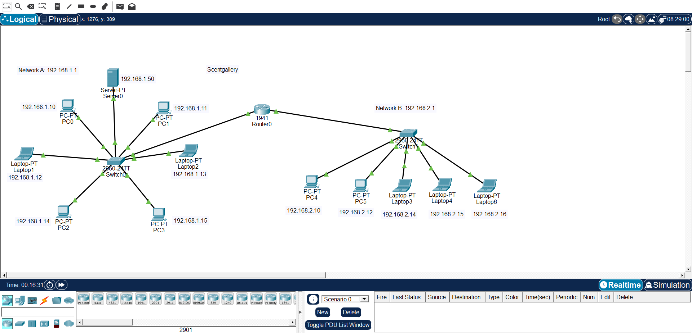
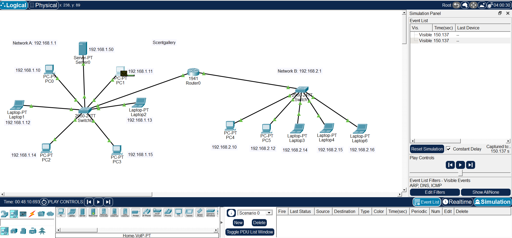
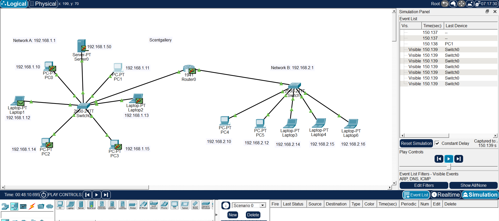
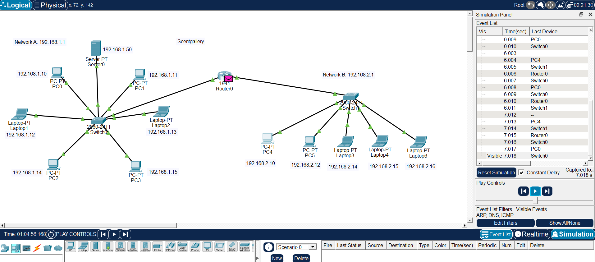

# Network Segmentation Lab - Scentgallery

## Overview
Isolated lab built in cisco packet Tracer to demonstrate why flat networks are insecure and how segmentation with 
router + switches helps.

## Topology
- **Network A:** 192.168.1.0/24 - 6 PCs/ Laptops + Server0 (192.168.1.50) -> Switch0 (2960-24TT)
- **Network B:** 192.168.2.0/24 - 5 PCs/ Laptops -> Switch1
- **Router:** 1941 Router0 connects Network A and B

## Objectives
1. Understand difference between Hub (broadcasts) vs Switch (learns MAC)
2. Configure inter-network routing
3. Test connectivity with ping
4. Next: Implement ACLs to restrict access

## Tests Performed
- [x] All hosts in Network A can ping Server0
- [x] PC0 (192.168.1.10) pings PC4 (192.168.2.10) via Router0
- [ ] ACL to block Network B from Server0 (coming next)

## Security Relevance
Flat hub network allows sniffing (all traffic seen by all hosts). Segmented switched network reduces broadcast domain 
and is first step to zero trust. Essential knowledge for SOC detention of lateral movement. 
What this lab taught me both side:
- **Attacker view:** On a flat hub network, all traffic is visible - easy to sniff credentials with tools like Wireshark. Segmentation breaks that.
- **Defender view:** With routing, Router0 becomes a choke point where I can apply ACLs and monitor lateral movement attempts.
This is why enumeration of subnets and routing is always first step in a network.

## Files
- 'scentgallery.pkt' - Packet Tracer file
- 'topology.png - Topology
- 'simulation.png - Simulation Mode (packet moving)'
- 'simulation1.png - Simulation Mode 2'
- 'ping-test.png - Ping Test Successful'

## Screenshots

## Tools
Cisco Packet Tracer 9.0.0

---
Built by Maggie - I'm at the start of my journey, exploring both Blue Team (SOC) and Red Team (Pentester) paths, but 
I know networking is the foundation for both that's why I'm building my fundamentals from networking up to exploitation.
Feedback from mentors are welcome!
